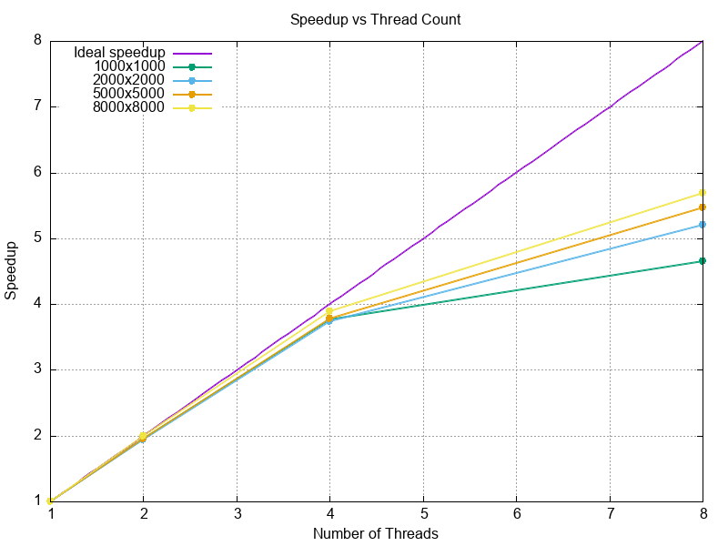
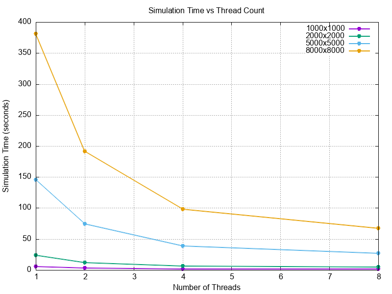
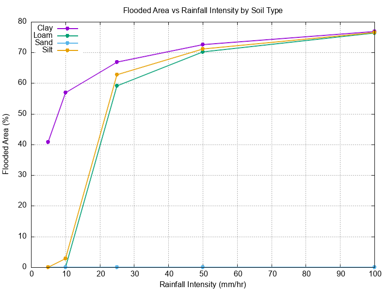

# Flood Forecasting Simulation (OpenMP)

A parallelized flood forecasting simulation written in C using OpenMP. Models rainfall, soil infiltration, and water routing across a terrain grid to predict flooded areas. Built as an HPC course project (COIS 4350) at Trent University.

---

## Overview

The simulation generates a synthetic terrain grid, smooths it using an averaging pass, and runs a timestep-based storm model. Each hour of the storm applies rainfall, removes water via Green-Ampt infiltration, and routes excess water downhill based on local surface gradients.

Two versions are included:

- **`proj.c`** — Serial baseline (1000×1000 grid)
- **`projOpen.c`** — OpenMP parallel version (tested up to 8000×8000 grid)

---

## Technical Approach

### Terrain Generation
A 1D flat array represents the 2D grid (`NUMROWS × NUMCOLS`). Elevations are randomly generated and then smoothed over 4 passes using 8-neighbor averaging to produce realistic terrain.

### D8 Flow Routing
Each cell stores a flow direction pointing to its lowest neighboring cell (D8 method). During water routing, excess water above a ponding threshold (`PONDING_DEPTH = 5.0 mm`) is distributed to all lower neighbors, weighted by the elevation drop to each one.

### Green-Ampt Infiltration
Infiltration is computed each timestep using the Green-Ampt model:

```
f = Ks * (1 + (ψ × Δθ) / F)
```

Where `Ks` is hydraulic conductivity, `ψ` is suction head, `Δθ` is moisture deficit, and `F` is cumulative infiltration. Four soil types are supported with real parameters:

| Soil | Ks (mm/hr) | Suction Head (mm) | Moisture Deficit |
|------|-----------|-------------------|-----------------|
| Clay | 0.3 | 316.3 | 0.385 |
| Loam | 10.9 | 88.9 | 0.434 |
| Sand | 117.8 | 49.5 | 0.437 |
| Silt | 6.5 | 166.8 | 0.486 |

### OpenMP Parallelization
The three core per-timestep functions are parallelized with `#pragma omp parallel for`:

- `applyRainfall` — embarrassingly parallel, no dependencies
- `applyInfiltration` — embarrassingly parallel, per-cell computation
- `waterRoute` — parallel with `#pragma omp atomic` for safe neighbor writes

Timing uses `omp_get_wtime()` for accurate wall-clock measurement across threads.

---

## Requirements

- GCC with OpenMP support (`gcc` on Linux/WSL, `brew install libomp` on macOS)
- Standard C library

---

## Build & Run

### Serial version
```bash
gcc -O2 -o proj proj.c
./proj
```

### OpenMP version
```bash
gcc -O2 -fopenmp -o projOpen projOpen.c
./projOpen
```

### Control thread count
```bash
export OMP_NUM_THREADS=8
./projOpen
```

### Runtime prompts
```
Please choose a soil type: 1=Clay  2=Loam  3=Sand  4=Silt
Please enter the duration of the storm in hours:
Please enter the rainfall intensity in mm/hr:
```

---

## Output Files

| File | Contents |
|------|----------|
| `terrain.dat` | Row, col, elevation for each cell |
| `flood.dat` | Row, col, flood status (0 or 1) |
| `sim_results.dat` | Grid size, threads, setup time, sim time, flooded count |
| `threads.dat` | Grid size, thread count, elapsed time |
| `speedup.dat` | Grid size, thread count, elapsed time (used for speedup plots) |
| `rainfall_results.dat` | Soil type, rainfall intensity, % flooded |
| `duration_results.dat` | Soil type, storm duration, % flooded |

---

## Performance Results

Tested on an 8000×8000 grid (64M cells), 1 hour storm, Loam soil.

| Threads | Sim Time (s) | Speedup |
|---------|-------------|---------|
| 1 | 381.14 | 1.00× |
| 2 | 191.27 | 1.99× |
| 4 | 98.07 | 3.89× |
| 8 | 67.00 | 5.69× |

Speedup scales near-linearly up to 4 threads and continues improving at 8. The gap from ideal is expected due to atomic write contention in `waterRoute` during neighbor accumulation.

### Speedup vs Thread Count


### Simulation Time vs Thread Count


---

## Simulation Results

### Flooded Area vs Rainfall Intensity
Clay soil floods heavily even at low rainfall due to poor infiltration. Sand stays near 0% until extreme intensities.



---

## Project Structure

```
floodSimulation/
├── proj.c               # Serial version (1000×1000)
├── projOpen.c           # OpenMP parallel version (up to 8000×8000)
├── speedup.dat          # Raw timing data by grid size and thread count
├── sim_results.dat      # Full simulation results log
├── threads.dat          # Thread count vs time data
├── duration_results.dat # Storm duration experiment results
├── rainfall.png         # Flooded area vs rainfall intensity chart
├── duration.png         # Flooded area vs storm duration chart
├── speedup.png          # Speedup vs thread count chart
├── speedup_lines.png    # Sim time vs thread count chart
└── README.md
```

---

## Author

Ferdinand Nel — Trent University, COIS 4350 High Performance Computing